# Sprint 1 – Diseño de Interfaces

## Objetivo
Diseñar las primeras interfaces del sistema TECHCUP FÚTBOL.

## Mockups incluidos

### Login
Permite a los usuarios autenticarse con su correo institucional o personal.

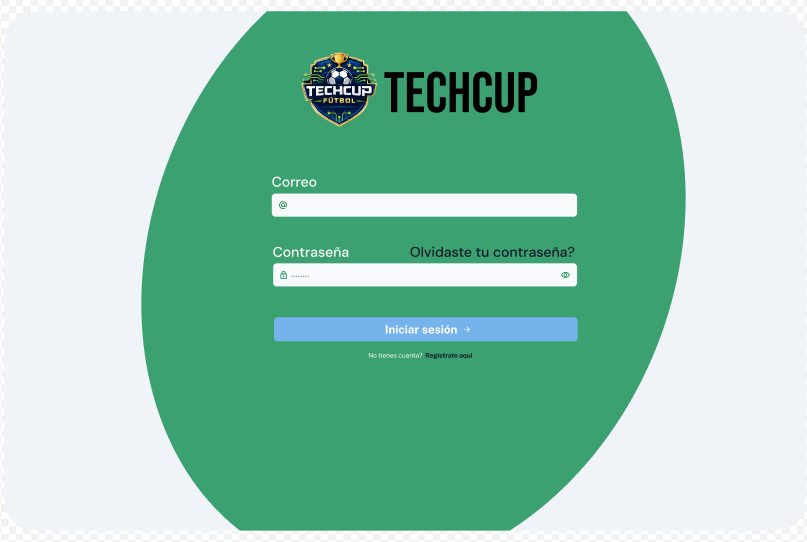

### Registro
Permite a los usuarios crear su perfil deportivo.

### FAQ
Se incluye una sección de soporte con preguntas frecuentes sobre el torneo.

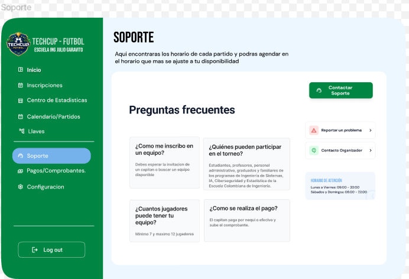

### Perfil Capitan
Visualizacion del perfil de capitan luego de iniciar sesión.

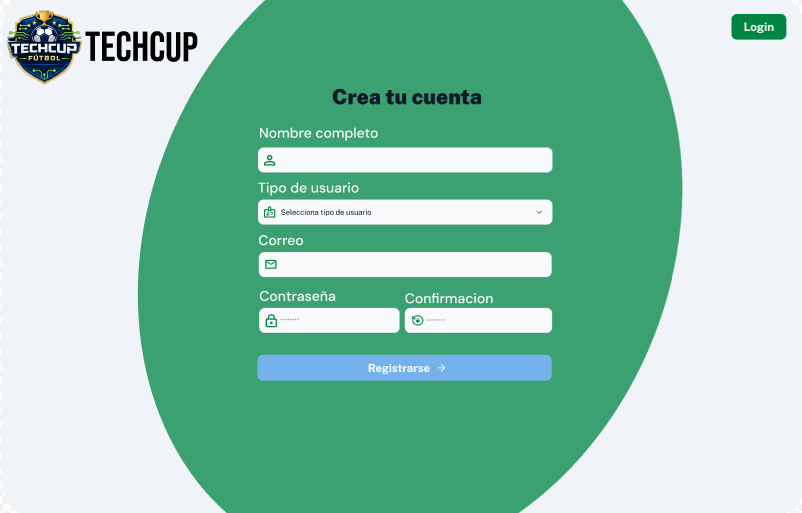

### Perfil Jugador
Visualizacion del perfil de jugador luego de iniciar sesión.

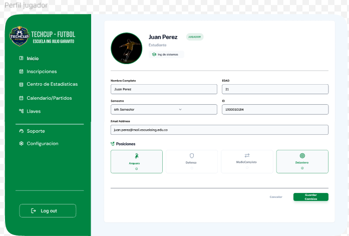

### Inicio Jugador 
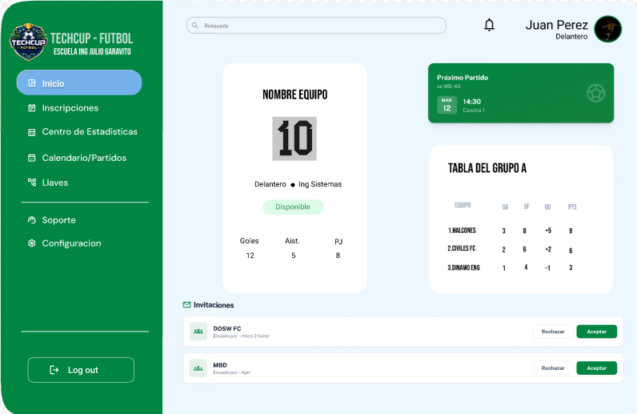

### Perfil Arbitro
Visualizacion del perfil de arbitro luego de iniciar sesión.

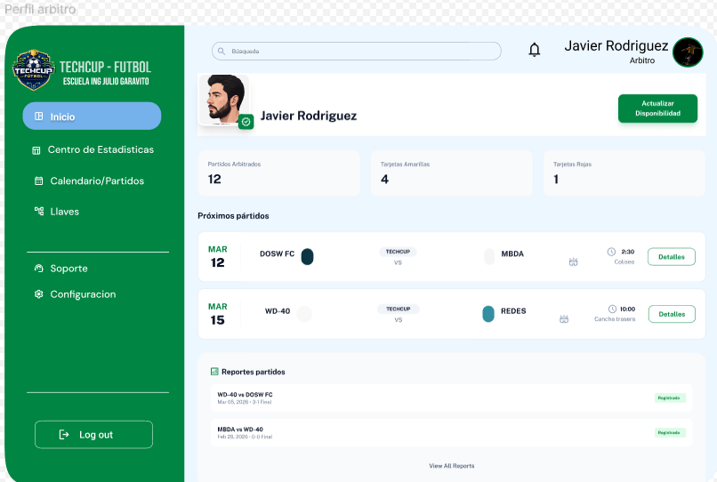

### Perfil Organizador
Visualizacion del perfil de Organizador luego de iniciar sesión.

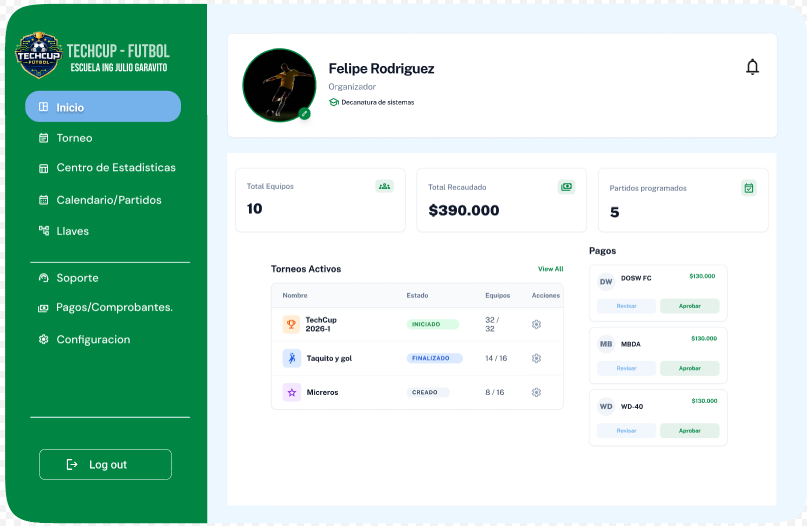

### Crear Torneo
Permite al Organizador crear el torneo.

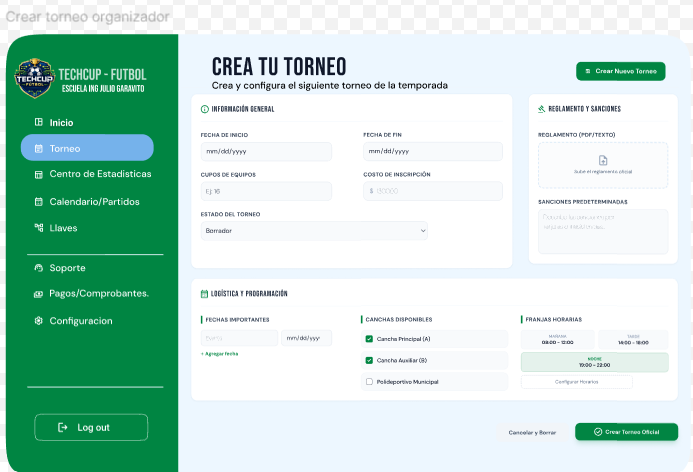

### Configuracion Torneo
Permite al Organizador crear el torneo.

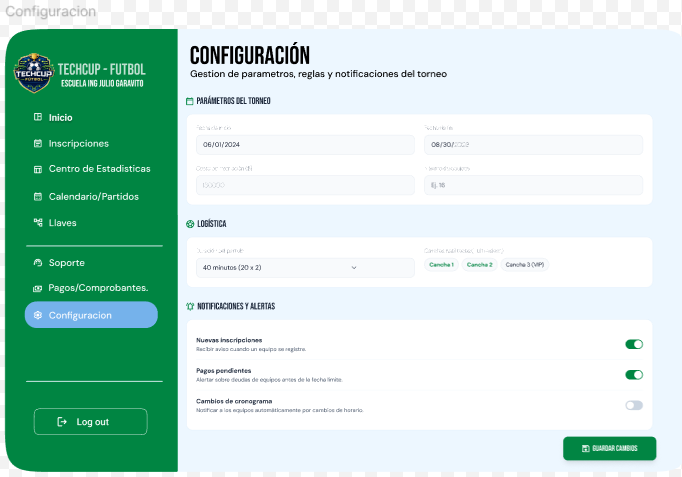

### Crear Equipo
Permite al Capitan crear el equipo.

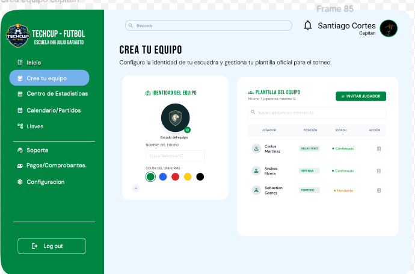

### Incripcion
Permite al Jugador inscribirse a un equipo.

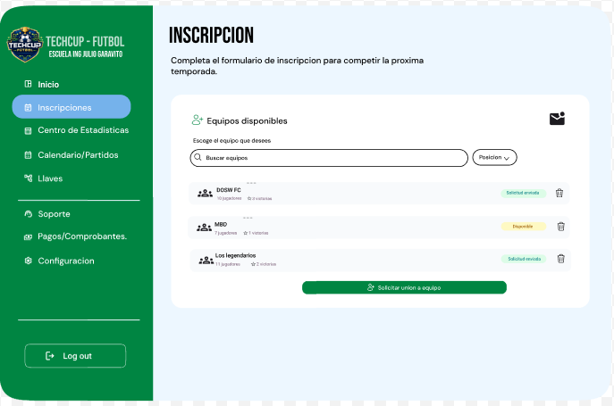

### Pagos
Permite al Capitan subir el comprobante de pago para el torneo.

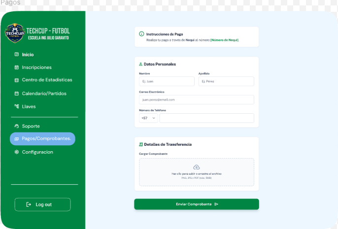

### Calendario
Permite al Organizador y jugadores visualizar el calendario del torneo.

### LLaves Eliminatorias 
Permite a los jugadores ver como avanzan los equipos. 

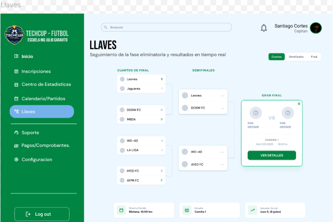

## Decisiones de diseño
- Interfaz simple y clara
- Colores relacionados con las carreras que participan en el torneo de fútbol
- Navegación intuitiva