# SPRINT#2 - Mejoras de interfaces

### Login
Permite a los usuarios autenticarse con su correo institucional o personal.

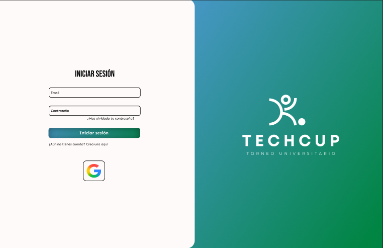

### Registro
Permite a los usuarios crear su perfil deportivo.

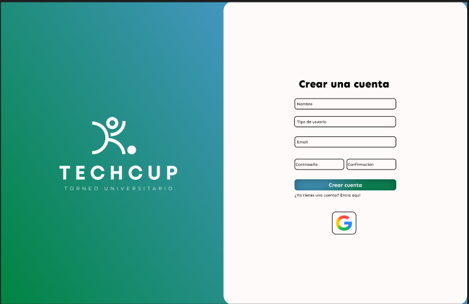

### Alineación
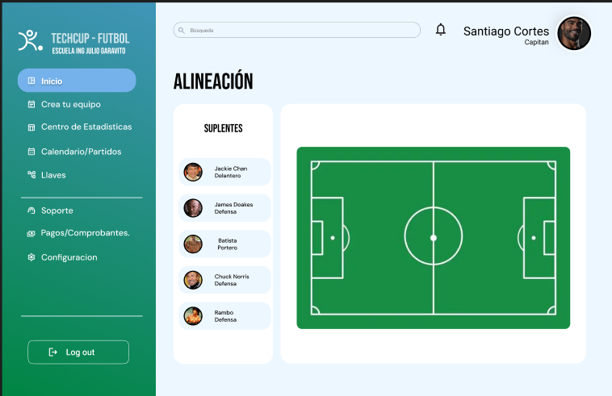

### Inicio Jugador

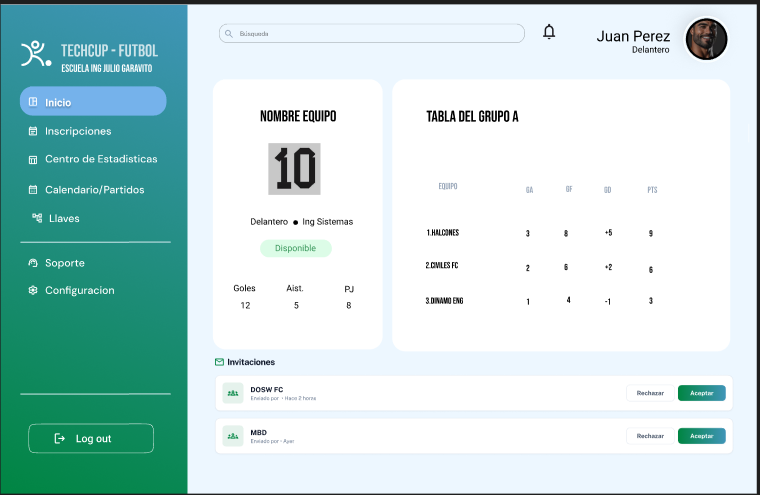

### Perfil Capitan
Visualizacion del perfil de capitan luego de iniciar sesión.

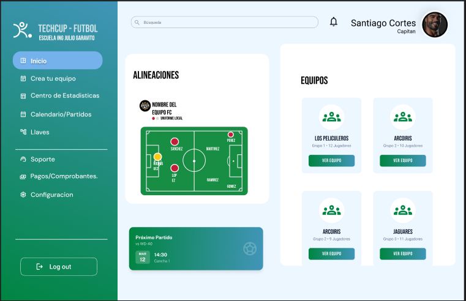

### Perfil Jugador
Visualizacion del perfil de jugador luego de iniciar sesión.

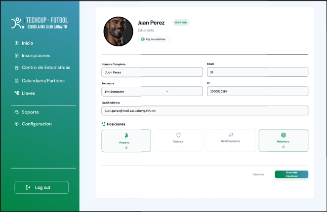

### Perfil Arbitro
Visualizacion del perfil de arbitro luego de iniciar sesión.

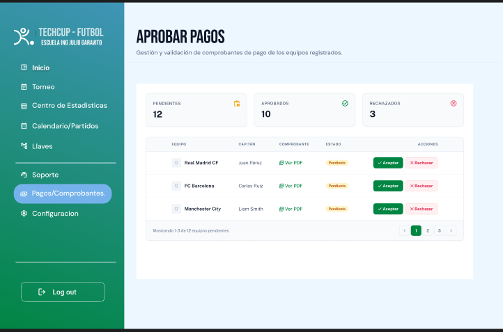

### Perfil Organizador
Visualizacion del perfil de Organizador luego de iniciar sesión.

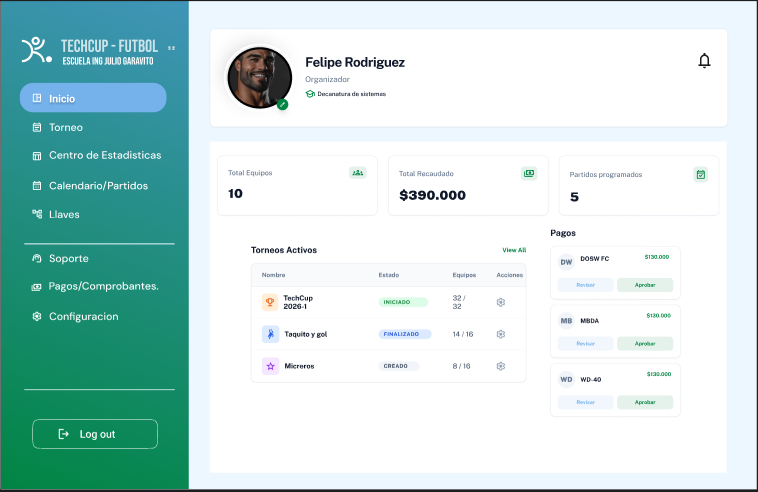

### Calendario
Permite al Organizador y jugadores visualizar el calendario del torneo.

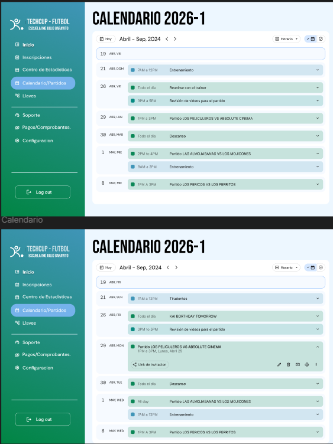

### Configuración Torneo
Permite al organizador configurar el torneo.

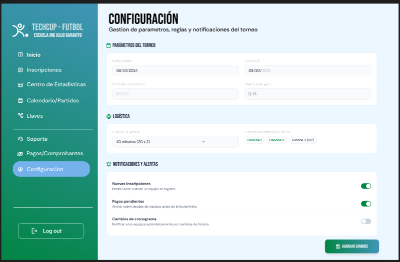

### Confirmación Finalizar Torneo
Mensaje de confirmación.

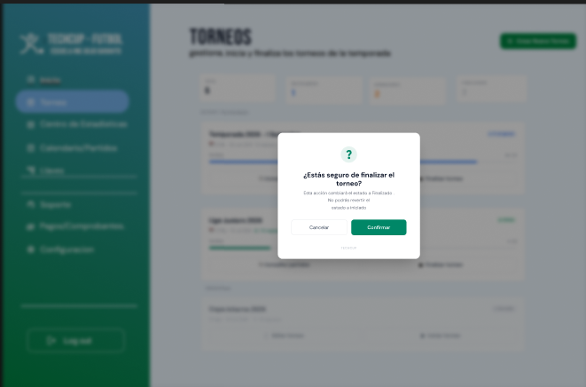

### Crear Torneo
Permite al organizador crear el torneo.
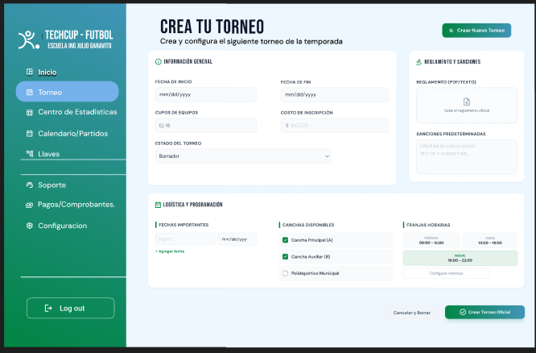

### Confirmación Torneo
Mensaje de confirmación.
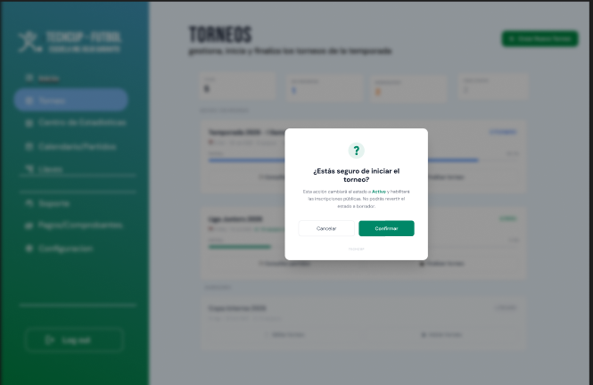

### Iniciar, Finalizar, Consultar Torneo
Permite al organizador iniciar, finalizar y consultar el torneo.

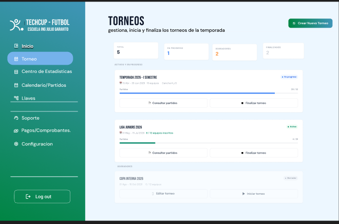

### Inscripción
Permite al Jugador inscribirse a un equipo.

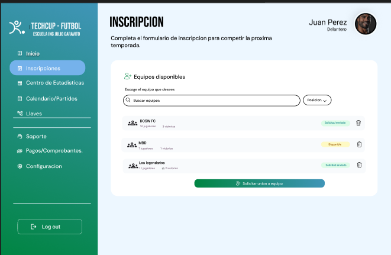

### Consultar Equipo

Permite al capitan ver sus integrantes.

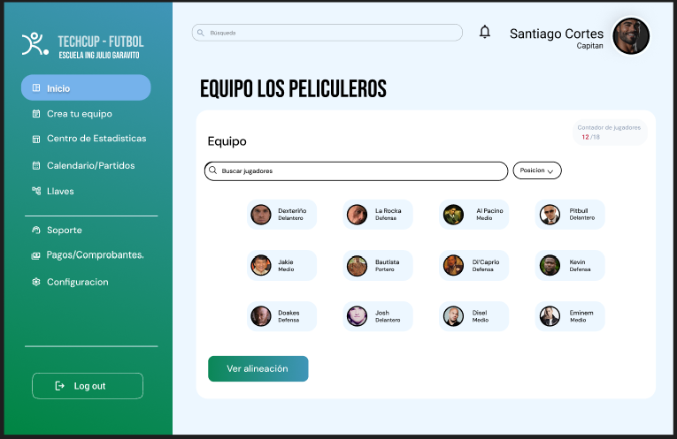

### CrearEquipo
Permite al capitan crear el equipo.

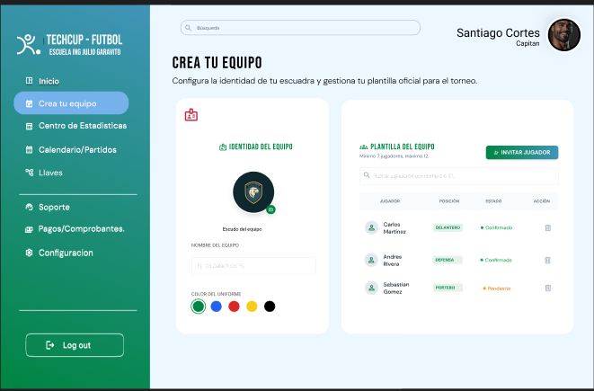

### Crear Logo

Permite al capitan crear el escudo de su equipo.

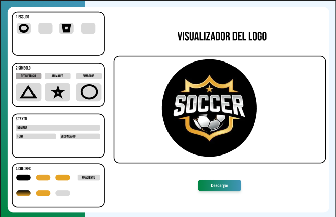

### Confirmacion Cración Logo
Mensaje de Confirmación.

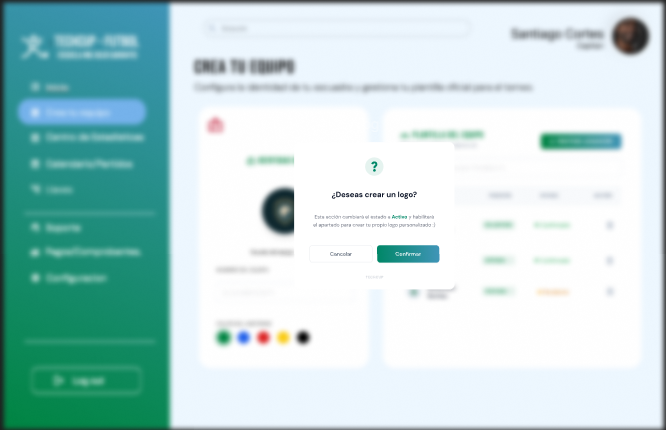

### Consultar Torneo
Permite ver un resumen del torneo.

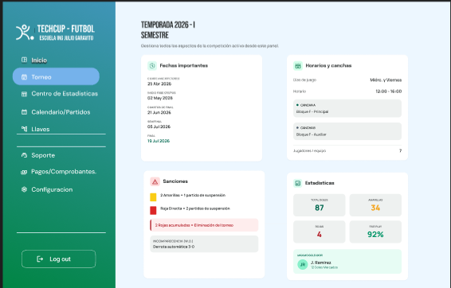

### Pagos
Permite al Capitan subir el comprobante de pago para el torneo.

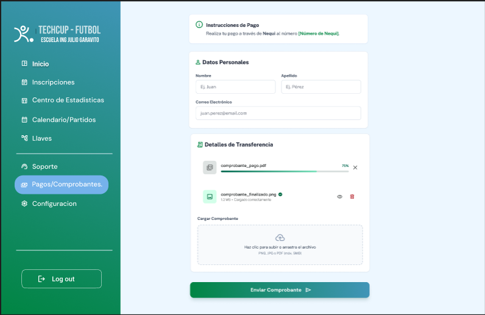

### Pagos Organizador
Permite al Organizador verificar el comprobante de pago para el torneo.

### Estadisticas

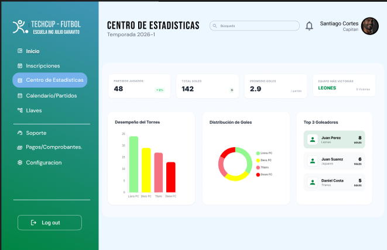

### Llaves Eliminatorias
Permite a los jugadores ver como avanzan los equipos.

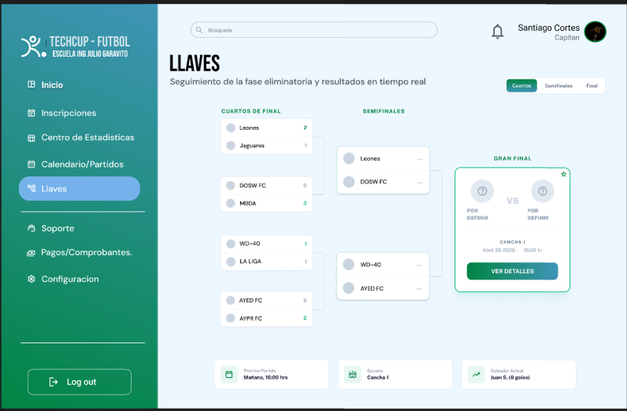

### Soporte
Se incluye una sección de soporte con preguntas frecuentes sobre el torneo.

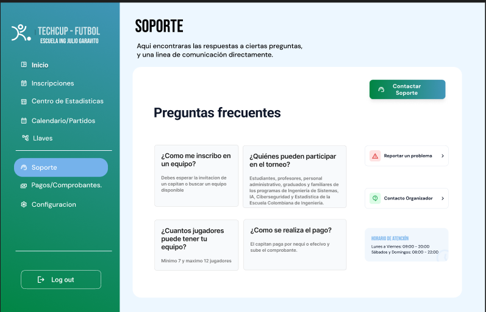