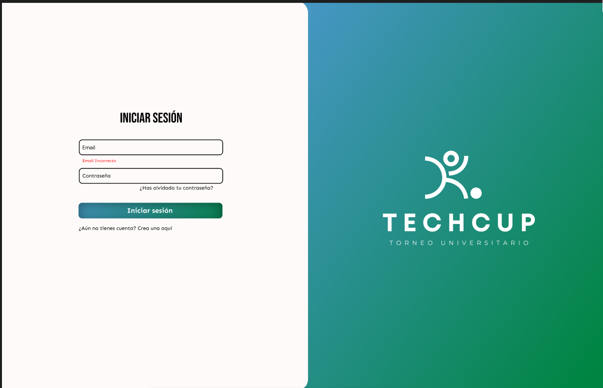
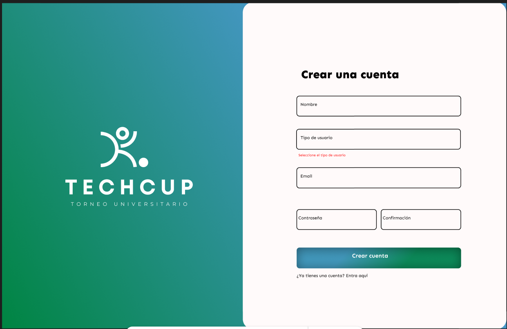
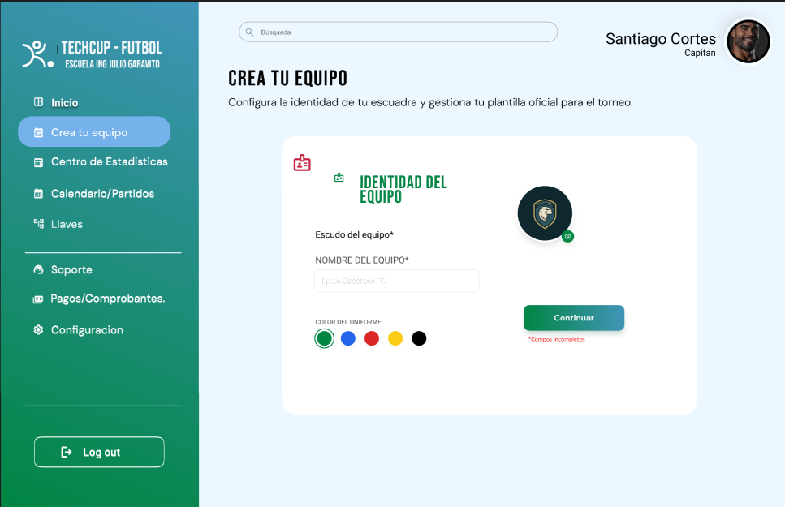
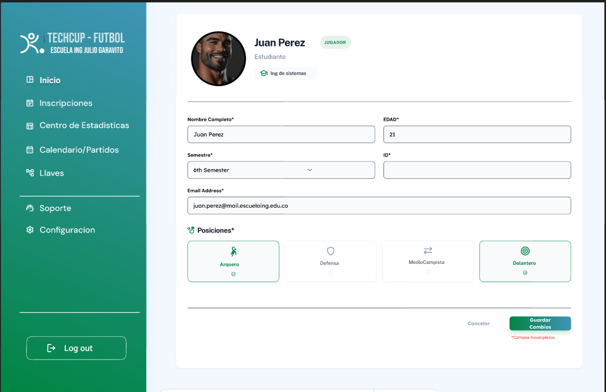
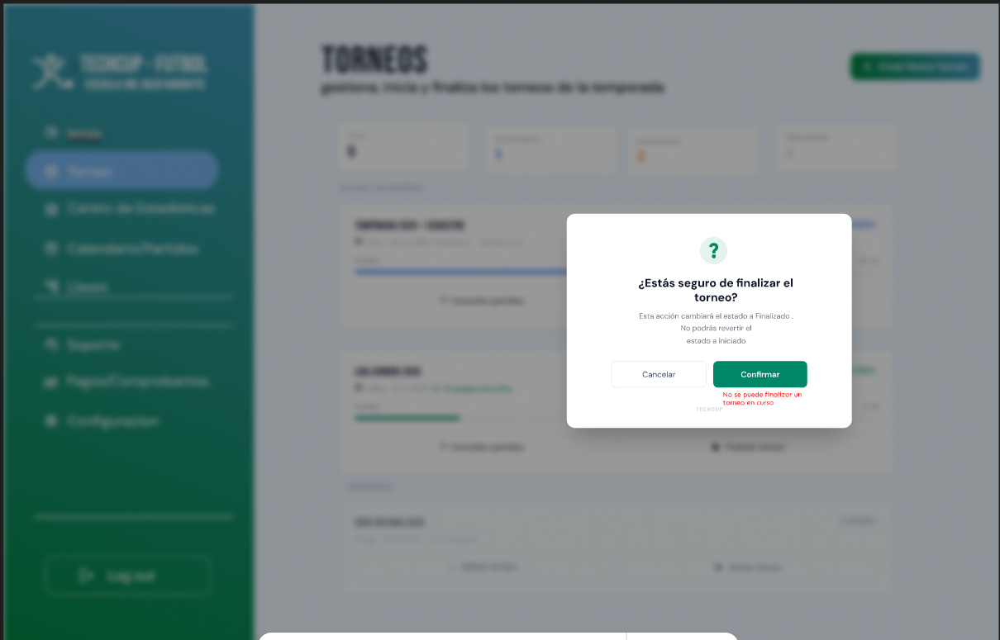
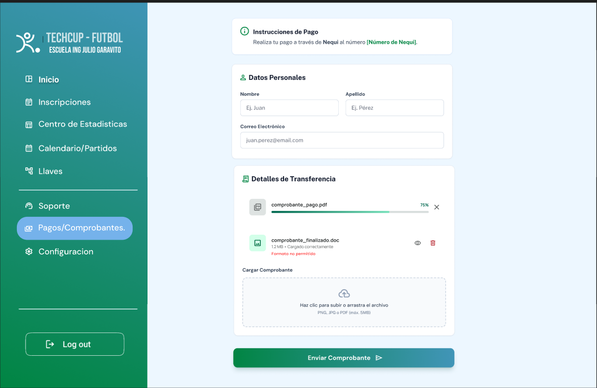
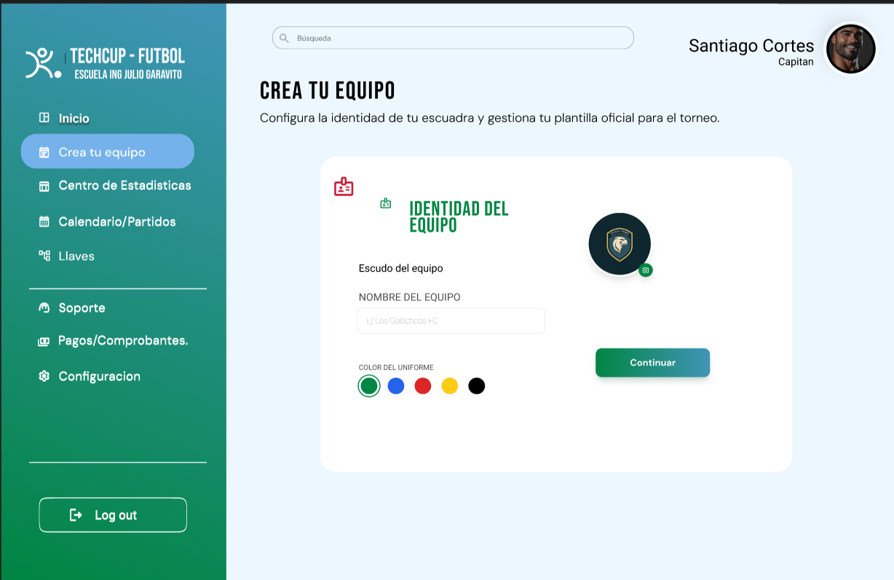
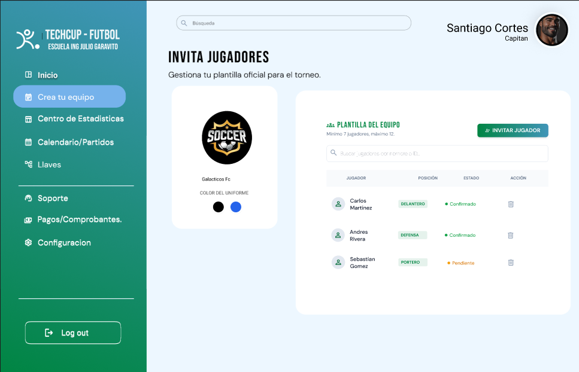
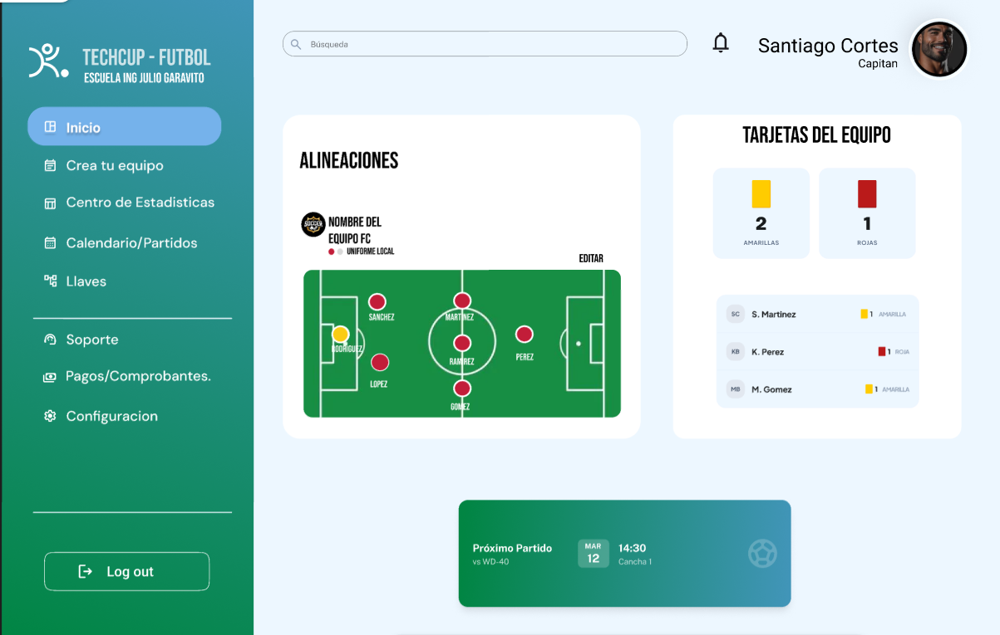
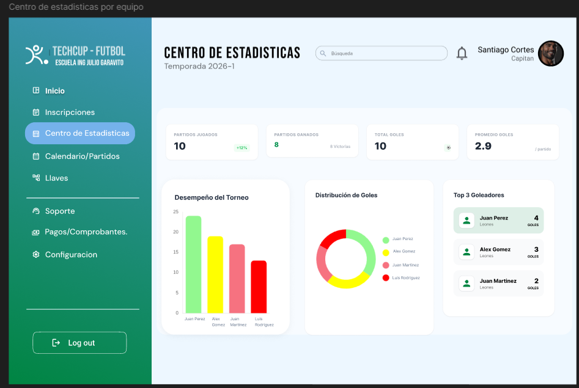

# Sprint #3 - Flujo de Errores

## Email Incorrecto
Ocurre cuando el participante interno introduce mal su correo.

## Contraseña Incorrecta
Ocurre cuando el participante interno introduce mal su contraseña.

## Registro Incorrecto
Ocurre cuando el participante interno o externo no selecciona el tipo de usuario.

## Campo Incompleto Crea tu equipo
Ocurre cuando el capitan no sube su logo, o no llena los datos de nombre del equipo y colores del uniforme. 

## Error perfil jugador
Ocurre cuando el jugador deja un campo sin llenar.

## Error Finalizar torneo
Ocurre cuando el organizador intenta finalizar un torneo que no ha terminado.

## Error Pagos
Ocurre cuando el Capitan sube un tipo de archivo que no es soportado.

## Error Fecha Configuración
Ocurre cuando el organizador selecciona una fecha anterior a la actual.

### Cambios implementados
* Se hizo la separacion de crear equipo e invitaciones

* Se modifico la vista del perfil de capitan, agregando la cantidad de trajetas del equipo y por jugador

* Se agrego Estadisticas por equipo

