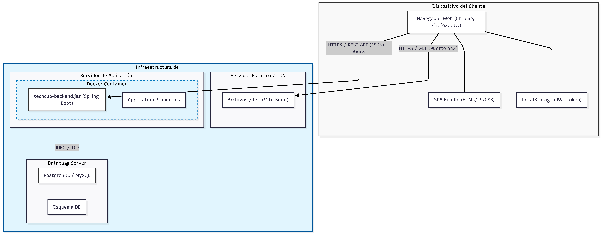

## Sprint #5

### Diagrama de implementacion del frontend

- El sistema se distribuye en tres nodos de despliegue. El Dispositivo del Cliente ejecuta en el navegador el SPA Bundle generado por Vite, descargado una única vez desde el Servidor Estático, quien solo tiene la responsabilidad de entregar estos archivos compilados sin procesamiento dinámico.
  El Contenedor Docker, definido mediante Dockerfile y compose.yml, aloja tanto el JAR de Spring Boot con toda la lógica de negocio como la base de datos, comunicándose internamente a través de JDBC.
  La comunicación entre el frontend y el backend se realiza mediante llamadas a la REST API usando Axios, viajando sobre HTTPS en producción para proteger el token JWT de autenticación